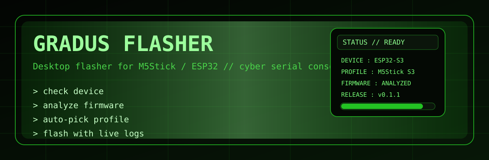
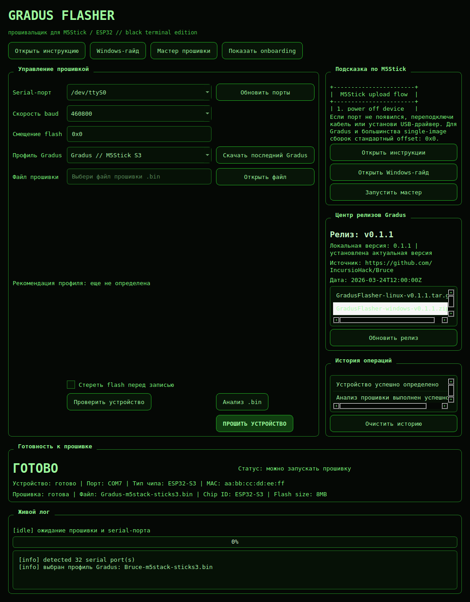
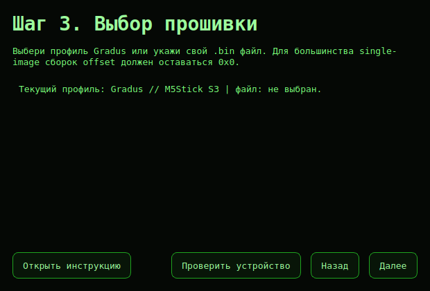

<div align="center">
  

  <h1>Gradus Flasher</h1>
  <p><strong>Кибер-флешер для M5Stick и Gradus.</strong> Desktop-приложение для прошивки устройств через serial-порт с мастером, логами и релиз-центром.</p>

  <p>
    
    
    
    
  </p>
</div>

```text
> target: M5Stick / Gradus devices
> transport: serial + esptool
> ui: black-green hacker mode
```

## обзор

`Gradus Flasher` помогает быстро выбрать профиль устройства, прошивку и безопасно прошить совместимые `M5Stick`/`ESP32`-устройства через удобный desktop-интерфейс.

## Скачать готовую Windows-версию

Если ты не хочешь ничего собирать сам, открой релиз `v0.1.6`:

- `https://github.com/GradusXaker/m5-flasher/releases/tag/v0.1.6`

Что скачивать:

- `GradusFlasher-Setup-v0.1.6.exe` — обычная установка
- `GradusFlasher-windows-v0.1.6.zip` — portable-версия

Если файл не виден, почти всегда причина в том, что репозиторий приватный и ты не вошел в GitHub под аккаунтом с доступом.

Начиная с этой версии, встроенная загрузка прошивок идет из `https://github.com/GradusXaker/gradus-firmware`.

## Возможности

- Поиск доступных serial-портов
- Выбор файла прошивки `.bin`
- Загрузка последней прошивки `Gradus` для поддерживаемых профилей `M5Stick`
- Прошивка через `esptool`
- Пошаговый мастер прошивки для первого запуска
- Проверка подключения, автоопределение чипа и подсказка профиля до прошивки
- Анализ `.bin`, встроенный центр релизов и проверка обновлений
- Живой лог и прогресс выполнения
- Хакерский черно-зеленый интерфейс
- История операций и сохранение последних настроек
- Страница `О программе` и встроенные ссылки на релизы/репозиторий
- Portable-режим, экспорт логов и Windows installer

## Скриншоты

### Главное окно



### Мастер прошивки



## Запуск

```bash
python3 -m venv .venv
source .venv/bin/activate
pip install -e .
python -m m5_flasher.main
```

## Сборка

```bash
source .venv/bin/activate
pip install pyinstaller
pyinstaller --noconfirm --windowed --name GradusFlasher src/m5_flasher/main.py
```

Автоматическая Windows-сборка настроена через GitHub Actions: `.github/workflows/windows-release.yml`

Для portable-режима создай рядом с приложением файл `portable.ini`.

Готовый билд после сборки:

- Linux: `dist/GradusFlasher/GradusFlasher`
- Windows после локальной сборки: `dist\GradusFlasher\GradusFlasher.exe`
- Windows installer: `dist\GradusFlasher-Setup-v0.1.6.exe`

## Заметки

- Стандартный flash offset: `0x0`
- Приложение оптимизировано под `M5Stick` и похожие устройства на `ESP32`
- Некоторым платам может понадобиться ручной вход в boot/download mode перед прошивкой
- Сейчас доступны профили `Gradus` для `M5Stick S3`, `M5StickC Plus2` и `M5StickC Plus 1.1`
- Под капотом загрузка использует совместимые upstream-бинарники, поэтому реальные имена исходных release-артефактов могут начинаться с `Bruce-`

## контакты

<p>
  <a href="https://github.com/GradusXaker"></a>
  <a href="https://vk.com/gradus_xaker"></a>
  <a href="mailto:gradus_xaker@mail.ru"></a>
</p>

